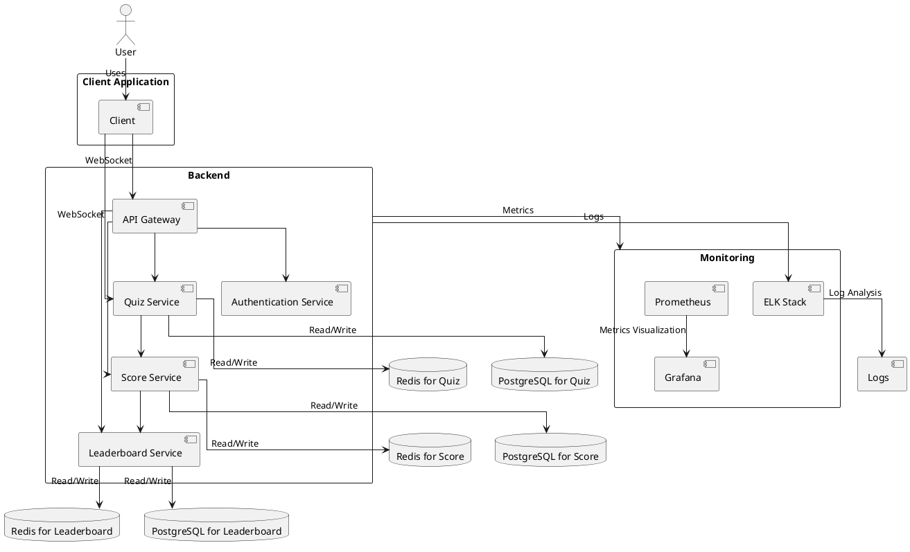
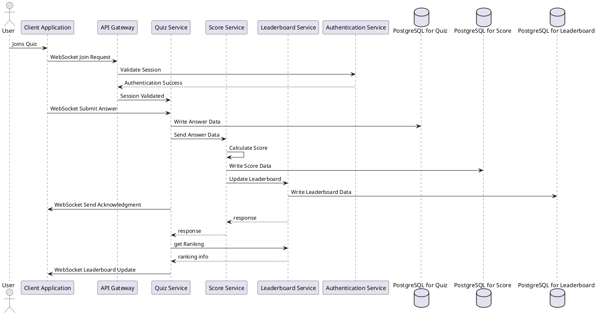

# Real-Time Vocabulary Quiz Coding Challenge

## Overview

Welcome to the Real-Time Quiz coding challenge! Your task is to create a technical solution for a real-time quiz feature for an English learning application. This feature will allow users to answer questions in real-time, compete with others, and see their scores updated live on a leaderboard.

## System Architecture

### Architecture Diagram

## Component Description

- **Client Application**:
  - Communicates with the Quiz Service using WebSocket for real-time interactions.
  - Communicates with the API Gateway for authentication and non-real-time requests.

- **API Gateway**:
  - Manages WebSocket connections and forwards requests to the appropriate backend services.
  - Handles user authentication via the Authentication Service.

- **Quiz Service**:
  - Manages WebSocket connections for real-time quiz interactions.
  - Handles quiz logic and updates quiz data in PostgreSQL.
  - Communicates with the Score Service to send answer data.
  - Uses Redis for caching quiz data.

- **Score Service**:
  - Receives answer data from the Quiz Service.
  - Calculates scores based on the answer data.
  - Updates score data in PostgreSQL.
  - Communicates with the Leaderboard Service to update the leaderboard.
  - Uses Redis for caching score data.

- **Leaderboard Service**:
  - Receives score updates from the Score Service.
  - Manages leaderboard data in PostgreSQL.
  - Uses Redis for caching leaderboard data.

- **Authentication Service**:
  - Handles user authentication.

- **Monitoring Tools**:
  - Prometheus for metrics collection.
  - Grafana for metrics visualization.
  - ELK Stack for log analysis.

- **Databases**:
  - Each service interacts with its respective PostgreSQL and Redis database for data storage and retrieval.

## Sequence Diagrams


## Data Flow

### User Joins Quiz:
1. The user uses the client application to join a quiz session using a unique quiz ID.
2. The client application sends a WebSocket join request to the API Gateway.
3. The API Gateway validates the session by communicating with the Authentication Service.
4. Once validated, the API Gateway forwards the request to the Quiz Service.

### Real-Time Quiz Participation:
1. The user interacts with the quiz in real-time through WebSocket communication with the Quiz Service.
2. The Quiz Service handles quiz logic and updates quiz data in PostgreSQL.

### Real-Time Score Updates:
1. When a user submits an answer, the client application sends the answer data via WebSocket to the Quiz Service.
2. The Quiz Service writes the answer data to PostgreSQL and sends it to the Score Service.
3. The Score Service calculates the score, updates the score data in PostgreSQL, and sends the updated score to the Leaderboard Service.

### Real-Time Leaderboard:
1. The Leaderboard Service updates the leaderboard data in PostgreSQL.
2. The updated leaderboard data is sent back to the Quiz Service.
3. The Quiz Service sends real-time leaderboard updates to the client application via WebSocket.


## Database Design
#### Quiz Database
- **Purpose**: Stores quiz data including questions, options, correct answers, and session information.
- **Tables**:
  - `quiz_sessions`: Stores information about active quiz sessions.
  - `questions`: Contains questions and their respective options.
  - `answers`: Records submitted answers by users for each session.

```sql
CREATE TABLE quiz_sessions (
    session_id SERIAL PRIMARY KEY,
    quiz_id INT NOT NULL,
    start_time TIMESTAMP NOT NULL DEFAULT CURRENT_TIMESTAMP,
    end_time TIMESTAMP,
    active BOOLEAN DEFAULT true
);

CREATE TABLE questions (
    question_id SERIAL PRIMARY KEY,
    quiz_id INT NOT NULL,
    question_text TEXT NOT NULL,
    options JSONB NOT NULL,
    correct_option INT NOT NULL,
    FOREIGN KEY (quiz_id) REFERENCES quiz_sessions(session_id) ON DELETE CASCADE
);

CREATE TABLE answers (
    answer_id SERIAL PRIMARY KEY,
    session_id INT NOT NULL,
    question_id INT NOT NULL,
    user_id INT NOT NULL,
    submitted_at TIMESTAMP NOT NULL DEFAULT CURRENT_TIMESTAMP,
    selected_option INT NOT NULL,
    is_correct BOOLEAN
);
```
#### Score Database (PostgresScore)
- **Purpose**: Manages user scores for quizzes.
- **Tables**:
  - `user_scores`: Stores scores of users participating in quizzes.
  - `score_history`: Logs historical score data for analysis and auditing.

```sql
CREATE TABLE user_scores (
    score_id SERIAL PRIMARY KEY,
    user_id INT NOT NULL,
    quiz_id INT NOT NULL,
    score INT NOT NULL,
    scored_at TIMESTAMP NOT NULL DEFAULT CURRENT_TIMESTAMP
);

CREATE TABLE score_history (
    history_id SERIAL PRIMARY KEY,
    score_id INT NOT NULL,
    user_id INT NOT NULL,
    quiz_id INT NOT NULL,
    score_change INT NOT NULL,
    change_reason TEXT,
    changed_at TIMESTAMP NOT NULL DEFAULT CURRENT_TIMESTAMP
);

```

#### Leaderboard Database (PostgresLeaderboard)
- **Purpose**: Stores leaderboard data.
- **Tables**:
  - `leaderboard`: Keeps track of user rankings based on scores.
  - `leaderboard_history`: Maintains historical data for leaderboard trends and changes.

```sql
CREATE TABLE leaderboard (
    rank_id SERIAL PRIMARY KEY,
    user_id INT NOT NULL,
    quiz_id INT NOT NULL,
    score INT NOT NULL,
    rank INT NOT NULL,
    updated_at TIMESTAMP NOT NULL DEFAULT CURRENT_TIMESTAMP
);

CREATE TABLE leaderboard_history (
    history_id SERIAL PRIMARY KEY,
    rank_id INT NOT NULL,
    user_id INT NOT NULL,
    quiz_id INT NOT NULL,
    previous_rank INT,
    new_rank INT,
    updated_at TIMESTAMP NOT NULL DEFAULT CURRENT_TIMESTAMP
);

```

### Redis Caching

#### Redis for Quiz (RedisQuiz)
- **Purpose**: Caches frequently accessed quiz data to improve performance.
- **Data**: Cached quiz sessions, questions, and answers to reduce database queries during quiz interactions.

#### Redis for Score (RedisScore)
- **Purpose**: Caches score-related data to facilitate quick score calculations and updates.
- **Data**: Cached user scores and temporary calculations during score updates.

#### Redis for Leaderboard (RedisLeaderboard)
- **Purpose**: Caches leaderboard data to quickly serve leaderboard requests without hitting the main database.
- **Data**: Cached leaderboard rankings and frequent leaderboard queries.

## Technology and Tools

- **React**: For building the client application to provide an interactive user interface.
- **WebSocket**: For real-time communication between the client application and the Quiz Service.
- **Spring Boot**: For developing backend services including the Quiz Service, Score Service, Leaderboard Service, and Authentication Service.
- **API Gateway**: For managing and routing API requests such as Kong Gateway, AWS Gateway
- **PostgreSQL**: As the primary database for storing quiz, score, and leaderboard data.
- **Redis**: For caching data in the Quiz Service, Score Service, and Leaderboard Service to improve performance.
- **Prometheus**: For metrics collection and monitoring.
- **Grafana**: For visualizing metrics collected by Prometheus.
- **ELK Stack**: For log collection and analysis.